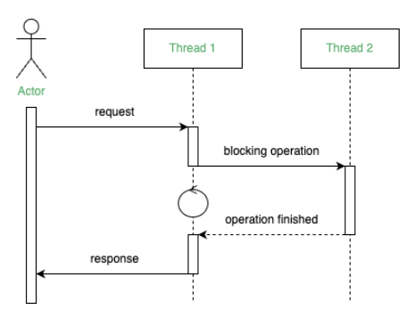
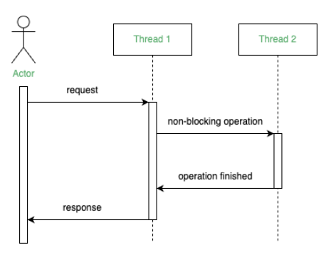

# Asynchronous Programming in Java

> This is a tutorials course covering asynchronous programming in Java.

Tools used:

- JDK 11
- Maven
- JUnit 5, Mockito
- IntelliJ IDE

## Table of contents

1. [Introduction to asynchronous programming](https://github.com/backstreetbrogrammer/36_AsynchronousProgramming#chapter-01-introduction-to-asynchronous-programming)
    - [Synchronous vs Asynchronous](https://github.com/backstreetbrogrammer/36_AsynchronousProgramming#synchronous-vs-asynchronous)
    - [Introduction to CompletableFuture](https://github.com/backstreetbrogrammer/36_AsynchronousProgramming#introduction-to-completablefuture)
        - [Using CompletableFuture as a Simple Future](https://github.com/backstreetbrogrammer/36_AsynchronousProgramming#using-completablefuture-as-a-simple-future)
        - [CompletableFuture sync and async methods](https://github.com/backstreetbrogrammer/36_AsynchronousProgramming#completablefuture-sync-and-async-methods)
    - [Interview Problem 1 (SCB): Design an API to fetch the best price market data from different providers](https://github.com/backstreetbrogrammer/36_AsynchronousProgramming#interview-problem-1-scb-design-an-api-to-fetch-the-best-price-market-data-from-different-providers)
2. [Chaining and Splitting tasks](https://github.com/backstreetbrogrammer/36_AsynchronousProgramming#chapter-02-chaining-and-splitting-tasks)
    - [Interview Problem 2 (SCB): Design an API to consume the fastest first market data received from different providers](https://github.com/backstreetbrogrammer/36_AsynchronousProgramming#interview-problem-2-scb-design-an-api-to-consume-the-fastest-first-market-data-received-from-different-providers)
        - [Follow Up 1: Design an API to get the best price market data from different providers](https://github.com/backstreetbrogrammer/36_AsynchronousProgramming#follow-up-1-design-an-api-to-get-the-best-price-market-data-from-different-providers)
    - [Chaining asynchronous tasks](https://github.com/backstreetbrogrammer/36_AsynchronousProgramming#chaining-asynchronous-tasks)
3. Controlling threads executing tasks
4. Error handling
5. Best patterns

---

## Chapter 01. Introduction to asynchronous programming

Having **high performance** and **availability** are essential parts of modern software development.

In other words, we need to write applications which has **maximum throughput** and **lowest latency**.

**Throughput**

> Throughput is a measure of how many units of information a system can process in a given amount of time.

For example, we need to improve performances for Input / Output operations.

Input / Output operations may be:

- accessing data from a disk
- over a network
- from a database

We need to understand the **asynchronous** programming paradigm to improve the **throughput** of our applications.

### Synchronous vs Asynchronous

**Synchronous**

> We need to wait for a task to complete to continue to work.

**Code snippet**

```
HTTPClient client = ...;
String response = client.get("https://github.com/backstreetbrogrammer/data");
```

We need to wait for the server to send us the response to process it. It may be several 100ms. In the meantime, our CPU
is doing nothing.

It's similar to a **blocking** operation in which the calling thread waits until the operation in another thread
completes before continuing with its execution:



Here, the tasks execute **sequentially**. `Thread 1` is blocked by `Thread 2`. In other words, `Thread 1` can't continue
with its execution until `Thread 2` finishes processing its tasks.

```
Synchronous == Blocking
```

A **synchronous** code is always **blocking**. It will slow down our application if it blocks for a long time.

**Asynchronous**

> The code we write will be executed at some point in the future.

**Code snippet**

```
List<String> strings = ...;
strings.forEach(s -> System.out.println(s));
```

Printing the elements of the list is done between `0` and `N` times => at some point in the future.

A **non-blocking** operation allows threads to perform multiple computations simultaneously without having to wait for
each task to complete.

The current thread can continue with its execution while the other threads perform tasks in parallel:



In the example above, `Thread 2` isn't blocking the execution of `Thread 1`. Furthermore, both threads are running their
tasks concurrently.

Beside improving the performance, we can decide what to do with the result once the non-blocking operation finishes with
execution.

Asynchronous programming may be used to avoid blocking calls and make our application faster.

The main advantage of using `CompletableFuture` is its ability to chain multiple tasks together that will be executed
without blocking the current thread. Therefore, we can say the `CompletableFuture` is **non-blocking**.

However, **asynchronous** and **synchronous** are **_NOT_** related to **concurrent** programming.

**Asynchronous** programming may rely on concurrency, but not always.

```
Asynchronous + Concurrency
```

Running a blocking code in another thread is a way to avoid blocking the main thread of our application.

```
        ExecutorService service = ...;
        HTTPClient client = ...;
        Future<String> future =
                service.submit(() – >
                        client.get("https://github.com/backstreetbrogrammer/data"));
        // do some other stuff
        String response = future.get();
```

The call to `get()` is still a **blocking** call, but blocks another thread and not the `main` thread. Our application
thread is free to do something else.

We can get the response through this `future` object By calling `future.get()`, which is a blocking call.

### Introduction to CompletableFuture

Java 8's Concurrent API introduced `CompletableFuture`, a valuable tool for simplifying asynchronous and non-blocking
programming.

The `CompletableFuture` class implements `CompletionStage` interface and the `Future` interface.

#### Using CompletableFuture as a Simple Future

`CompletableFuture` class implements the `Future` interface so that we can use it as a `Future` implementation but with
additional **completion** logic.

For example, we can create an instance of `CompletableFuture` class with a **no-arg** constructor to represent some
future result, hand it out to the consumers, and complete it at some time in the future using the **complete** method.
The consumers may use the **get** method to **block** the current thread until this result is provided.

In the example below, we have a method that creates a `CompletableFuture` instance, then spins off some computation in
another thread and returns the `Future` immediately.

When the computation is done, the method **completes** the `Future` by providing the result to the **complete** method:

```java
import java.util.concurrent.*;

public class CompletableFutureAsFuture {

    public Future<String> calculateAsync() {
        final CompletableFuture<String> completableFuture = new CompletableFuture<>();

        Executors.newCachedThreadPool().submit(() -> {
            TimeUnit.MILLISECONDS.sleep(500L);
            completableFuture.complete("Hello Students");
            return null;
        });

        return completableFuture;
    }

    public static void main(final String[] args) throws ExecutionException, InterruptedException {
        final CompletableFutureAsFuture obj = new CompletableFutureAsFuture();
        final Future<String> completableFuture = obj.calculateAsync();
        final String result = completableFuture.get(); // blocking call
        System.out.println(result);
    }
}
```

If we already know the result of a computation, we can use the static `completedFuture()` method with an argument that
represents the result of this computation. Consequently, the `get()` method of the `Future` will never block,
immediately returning this result instead:

```
Future<String> completableFuture = 
  CompletableFuture.completedFuture("Hello Students");

// ...

String result = completableFuture.get(); // will return immediately
assertEquals("Hello Students", result);
```

#### CompletableFuture sync and async methods

`CompletableFuture` offers an extensive API consisting of more than `50` methods. Many of these methods are available in
two variants: **non-async** and **async**.

Static methods `runAsync()` and `supplyAsync()` allow us to create a `CompletableFuture` instance out of `Runnable` and
`Supplier` functional types correspondingly.

The `Runnable` interface is the same old interface used in threads and does not allow to return a value.

The `Supplier` interface is a generic functional interface with a single method that has no arguments and returns a
value of a parameterized type.

This allows us to provide an instance of the `Supplier` as a lambda expression that does the calculation and returns the
result.

```
CompletableFuture<String> future
  = CompletableFuture.supplyAsync(() -> "Hello Students");

// ...

assertEquals("Hello Students", future.get());
```

Other examples:

**Non-async methods**

```
    @Test
    void testNonAsyncMethod() throws ExecutionException, InterruptedException {
        final CompletableFuture<String> greetings = CompletableFuture.supplyAsync(() -> "Hello Students");
        final CompletableFuture<Integer> greetingsLength = greetings.thenApply(value -> {
            System.out.println(Thread.currentThread().getName());
            return value.length();
        });
        assertEquals(14, greetingsLength.get());
    }
```

**Sample output**

```
ForkJoinPool.commonPool-worker-3
(or)
main
```

When utilizing `thenApply()`, we pass a function as a parameter that takes the previous value of the `CompletableFuture`
as input, performs an operation, and returns a new value. Consequently, a fresh `CompletableFuture` is created to
encapsulate the resulting value.

The function passed as a parameter to `thenApply()` will be executed by the thread that directly interacts with
`CompletableFuture`'s API, in our case, the `main` thread **OR** `ForkJoinPool.commonPool()` thread.

**Async methods**

The majority of methods within the API possess an **asynchronous** counterpart. We can use these `async` variants to
ensure that the intermediate operations are executed on a separate thread pool. Let's change the previous code example
and switch from `thenApply()` to `thenApplyAsync()`:

```
    @Test
    void testAsyncMethod() throws ExecutionException, InterruptedException {
        final CompletableFuture<String> greetings = CompletableFuture.supplyAsync(() -> "Hello Students");
        final CompletableFuture<Integer> greetingsLength = greetings.thenApplyAsync(value -> {
            System.out.println(Thread.currentThread().getName());
            return value.length();
        });
        assertEquals(14, greetingsLength.get());
    }
```

**Sample output**

```
ForkJoinPool.commonPool-worker-3
```

If we use the `async` methods without explicitly providing an `Executor`, the functions will be executed using
`ForkJoinPool.commonPool()` thread.

Printing the same example using `Executor`:

```
    @Test
    void testAsyncMethodUsingExecutor() throws ExecutionException, InterruptedException {
        final Executor testExecutor = Executors.newFixedThreadPool(4);
        final CompletableFuture<String> greetings = CompletableFuture.supplyAsync(() -> "Hello Students");
        final CompletableFuture<Integer> greetingsLength = greetings.thenApplyAsync(value -> {
            System.out.println(Thread.currentThread().getName());
            return value.length();
        }, testExecutor);
        assertEquals(14, greetingsLength.get());
    }
```

**Sample output**

```
pool-1-thread-1
```

This is the thread name given to the thread pool in `Executor`.

As expected, when using the overloaded method, the `CompletableFuture` will no longer use the common `ForkJoinPool`
threads but the `Executor` thread pool.

### Interview Problem 1 (SCB): Design an API to fetch the best price market data from different providers

We have 3 different stock market data providers which provide market data in real time.

Design an API to select the market data which has got the best (lowest) price to buy a stock.

**Solution**

`MarketData` class:

```java
public class MarketData {

    private final String server;
    private final String symbol;
    private final double price;

    public MarketData(final String server, final String symbol, final double price) {
        this.server = server;
        this.symbol = symbol;
        this.price = price;
    }

    public String getServer() {
        return server;
    }

    public String getSymbol() {
        return symbol;
    }

    public double getPrice() {
        return price;
    }

    @Override
    public String toString() {
        return "MarketData{" +
                "server='" + server + '\'' +
                ", symbol='" + symbol + '\'' +
                ", price=" + price +
                '}';
    }
}
```

- First Approach: Using **Synchronous** API

```java
import java.time.Duration;
import java.time.Instant;
import java.util.Comparator;
import java.util.List;
import java.util.concurrent.Callable;
import java.util.concurrent.ThreadLocalRandom;
import java.util.concurrent.TimeUnit;

public class FetchMarketDataSynchronously {

    public static void main(final String[] args) {
        run();
    }

    public static void run() {
        final ThreadLocalRandom random = ThreadLocalRandom.current();

        final Callable<MarketData> fetchMarketDataReuters =
                () -> {
                    TimeUnit.MILLISECONDS.sleep(random.nextLong(80L, 120L));
                    return new MarketData("Reuters", "META", random.nextDouble(40D, 60D));
                };

        final Callable<MarketData> fetchMarketDataBloomberg =
                () -> {
                    TimeUnit.MILLISECONDS.sleep(random.nextLong(80L, 120L));
                    return new MarketData("Bloomberg", "META", random.nextDouble(30D, 70D));
                };

        final Callable<MarketData> fetchMarketDataExegy =
                () -> {
                    TimeUnit.MILLISECONDS.sleep(random.nextLong(80L, 120L));
                    return new MarketData("Exegy", "META", random.nextDouble(40D, 80D));
                };

        final var marketDataTasks =
                List.of(fetchMarketDataReuters, fetchMarketDataBloomberg, fetchMarketDataExegy);

        final Instant start = Instant.now();
        final MarketData bestMarketData =
                marketDataTasks.stream()
                               .map(FetchMarketDataSynchronously::fetchMarketData)
                               .min(Comparator.comparing(MarketData::getPrice))
                               .orElseThrow();
        final long timeElapsed = Duration.between(start, Instant.now()).toMillis();
        System.out.printf("Best price [SYNC ] = %s (%d ms)%n", bestMarketData, timeElapsed);
    }

    private static MarketData fetchMarketData(final Callable<MarketData> task) {
        try {
            return task.call();
        } catch (final Exception e) {
            throw new RuntimeException(e);
        }
    }

}
```

**Sample Output**

```
Best price [SYNC ] = MarketData{server='Exegy', symbol='META', price=41.398256277344316} (360 ms)
```

Running it multiple times gives us an average of `280-380 ms`.

- Second Approach: Using **Asynchronous** API with `ExecutorService`

```java
import java.time.Duration;
import java.time.Instant;
import java.util.ArrayList;
import java.util.Comparator;
import java.util.List;
import java.util.concurrent.*;

public class FetchMarketDataAsynchronouslyExecutorService {

    public static void main(final String[] args) throws ExecutionException, InterruptedException {
        final ThreadLocalRandom random = ThreadLocalRandom.current();

        final Callable<MarketData> fetchMarketDataReuters =
                () -> {
                    TimeUnit.MILLISECONDS.sleep(random.nextLong(80L, 120L));
                    return new MarketData("Reuters", "META", random.nextDouble(40D, 60D));
                };

        final Callable<MarketData> fetchMarketDataBloomberg =
                () -> {
                    TimeUnit.MILLISECONDS.sleep(random.nextLong(80L, 120L));
                    return new MarketData("Bloomberg", "META", random.nextDouble(30D, 70D));
                };

        final Callable<MarketData> fetchMarketDataExegy =
                () -> {
                    TimeUnit.MILLISECONDS.sleep(random.nextLong(80L, 120L));
                    return new MarketData("Exegy", "META", random.nextDouble(40D, 80D));
                };

        final var marketDataTasks =
                List.of(fetchMarketDataReuters, fetchMarketDataBloomberg, fetchMarketDataExegy);

        final var executor = Executors.newFixedThreadPool(4);
        final Instant start = Instant.now();

        // run all the tasks asynchronously
        final List<Future<MarketData>> futures = executor.invokeAll(marketDataTasks);

        final List<MarketData> marketDataList = new ArrayList<>();
        for (final Future<MarketData> future : futures) {
            final MarketData marketData = future.get();
            marketDataList.add(marketData);
        }

        final MarketData bestMarketData =
                marketDataList.stream()
                              .min(Comparator.comparing(MarketData::getPrice))
                              .orElseThrow();

        final long timeElapsed = Duration.between(start, Instant.now()).toMillis();
        System.out.printf("Best price [ES ] = %s (%d ms)%n", bestMarketData, timeElapsed);

        executor.shutdown();
    }

}
```

**Sample Output**

```
Best price [ES ] = MarketData{server='Reuters', symbol='META', price=56.48773820323322} (130 ms)
```

Running it multiple times gives us an average of `120-135 ms`.

- Final Approach: Using **Asynchronous** API with `CompletableFuture`

```java
import java.time.Duration;
import java.time.Instant;
import java.util.ArrayList;
import java.util.Comparator;
import java.util.List;
import java.util.concurrent.CompletableFuture;
import java.util.concurrent.ThreadLocalRandom;
import java.util.concurrent.TimeUnit;
import java.util.function.Supplier;

public class FetchMarketDataAsynchronouslyCompletableFuture {

    public static void main(final String[] args) {
        run();
    }

    public static void run() {
        final ThreadLocalRandom random = ThreadLocalRandom.current();

        final Supplier<MarketData> fetchMarketDataReuters =
                () -> {
                    try {
                        TimeUnit.MILLISECONDS.sleep(random.nextLong(80L, 120L));
                    } catch (final InterruptedException e) {
                        throw new RuntimeException(e);
                    }
                    return new MarketData("Reuters", "META", random.nextDouble(40D, 60D));
                };

        final Supplier<MarketData> fetchMarketDataBloomberg =
                () -> {
                    try {
                        TimeUnit.MILLISECONDS.sleep(random.nextLong(80L, 120L));
                    } catch (final InterruptedException e) {
                        throw new RuntimeException(e);
                    }
                    return new MarketData("Bloomberg", "META", random.nextDouble(30D, 70D));
                };

        final Supplier<MarketData> fetchMarketDataExegy =
                () -> {
                    try {
                        TimeUnit.MILLISECONDS.sleep(random.nextLong(80L, 120L));
                    } catch (final InterruptedException e) {
                        throw new RuntimeException(e);
                    }
                    return new MarketData("Exegy", "META", random.nextDouble(40D, 80D));
                };

        final var marketDataTasks =
                List.of(fetchMarketDataReuters, fetchMarketDataBloomberg, fetchMarketDataExegy);

        final Instant start = Instant.now();

        // run all the tasks asynchronously
        final List<CompletableFuture<MarketData>> futures = new ArrayList<>();
        for (final Supplier<MarketData> task : marketDataTasks) {
            final CompletableFuture<MarketData> future = CompletableFuture.supplyAsync(task);
            futures.add(future);
        }

        final List<MarketData> marketDataList = new ArrayList<>();
        for (final CompletableFuture<MarketData> future : futures) {
            final MarketData marketData = future.join();
            marketDataList.add(marketData);
        }

        final MarketData bestMarketData =
                marketDataList.stream()
                              .min(Comparator.comparing(MarketData::getPrice))
                              .orElseThrow();

        final long timeElapsed = Duration.between(start, Instant.now()).toMillis();
        System.out.printf("Best price [CF ] = %s (%d ms)%n", bestMarketData, timeElapsed);
    }

}
```

**Sample Output**

```
Best price [CF ] = MarketData{server='Bloomberg', symbol='META', price=35.023580893186185} (143 ms)
```

Running it multiple times gives us an average of `130-145 ms`.

- Running all the tasks together to better compare the performance

```java
import java.util.concurrent.ExecutionException;

public class FetchMarketDataAll {

    public static void main(final String[] args) throws ExecutionException, InterruptedException {
        FetchMarketDataSynchronously.run();
        FetchMarketDataAsynchronouslyExecutorService.run();
        FetchMarketDataAsynchronouslyCompletableFuture.run();
    }

}
```

**Sample Output**

```
Best price [SYNC ] = MarketData{server='Reuters', symbol='META', price=58.52626690961024} (316 ms)
Best price [ES ] = MarketData{server='Reuters', symbol='META', price=56.48773820323322} (123 ms)
Best price [CF ] = MarketData{server='Reuters', symbol='META', price=56.48773820323322} (126 ms)
```

As seen from the above results, fetching the data **asynchronously** helps to increase the **throughput** of the
application.

---

## Chapter 02. Chaining and Splitting tasks

We can trigger an **async** task after the **completion** of another **async** task. In this way, we can chain
multiple **async** tasks.

Let's take an example where:

- we get **MarketData** from a provider
- then we store it in **Database**
- then we send the **Database** details in the **email** to the backoffice team.

**Code snippet**

```
        final ExecutorService executor = Executors.newFixedThreadPool(4);

        final Future<MarketData> futureMarketData = executor.submit(() -> getMarketData());
        final MarketData marketData = futureMarketData.get();

        final Future<Database> futureDB = executor.submit(() -> writeToDB(marketData));
        final Database db = futureDB.get();

        final Future<Email> futureEmail = executor.submit(() -> emailDatabaseDetails(db));
        final Email email = futureEmail.get();

        // continue....
```

A thread is a scarce resource and blocking a thread for a long time is expensive!

We want to avoid having to get the result back to the `main` thread.

The **solution** is to trigger a task on the outcome of another task.

We can also trigger **multiple** tasks after the outcome of **one** task and also trigger **one** task after the outcome
of **multiple** tasks.

**Code snippet**

```
        final CompletableFuture<MarketData> marketDataCF = CompletableFuture.supplyAsync(() -> getMarketData());
        final CompletableFuture<Database> dbCF = marketDataCF.thenApply(marketData -> writeToDB(marketData));
        final CompletableFuture<Email> emailCF = dbCF.thenApply(db -> emailDatabaseDetails(db));

        // continue....
        
        // if want to wait for all the independent tasks like CountDownLatch
        // CompletableFuture.allOf(marketDataCF, dbCF, emailCF).join();
```

Besides having `thenApply()` method, there are several other methods available in
[CompletionStage API](https://docs.oracle.com/en/java/javase/11/docs/api/java.base/java/util/concurrent/CompletionStage.html)

The main methods are:

```
stage.thenApply(x -> square(x))                // Function
      .thenAccept(x -> System.out.print(x))    // Consumer
      .thenRun(() -> System.out.println());    // Runnable
```

**Launching several tasks**

Instead of just launching one task asynchronously and triggering synchronous actions on its output, we can launch
several tasks at once asynchronously and chain them.

### Interview Problem 2 (SCB): Design an API to consume the fastest first market data received from different providers

Suppose we have 3 market data providers: Reuters, Bloomberg and Exegy. We want to get the fastest market data whichever
provides it first. Design the API for same.

**Solution**

We can use `CompletableFuture.anyOf()` method:

- returns a `CompletableFuture`
- that completes on the **first** task
- returns the result of this **first** task
- **normally** or **exceptionally**

```java
import com.backstreetbrogrammer.model.MarketData;

import java.util.concurrent.CompletableFuture;
import java.util.concurrent.ThreadLocalRandom;
import java.util.concurrent.TimeUnit;
import java.util.function.Supplier;

public class CompletableFutureAnyOfDemo {

    public static void main(final String[] args) {
        final ThreadLocalRandom random = ThreadLocalRandom.current();

        final Supplier<MarketData> fetchMarketDataReuters =
                () -> {
                    try {
                        TimeUnit.MILLISECONDS.sleep(random.nextLong(80L, 120L));
                    } catch (final InterruptedException e) {
                        throw new RuntimeException(e);
                    }
                    return new MarketData("Reuters", "META", random.nextDouble(40D, 60D));
                };

        final Supplier<MarketData> fetchMarketDataBloomberg =
                () -> {
                    try {
                        TimeUnit.MILLISECONDS.sleep(random.nextLong(80L, 120L));
                    } catch (final InterruptedException e) {
                        throw new RuntimeException(e);
                    }
                    return new MarketData("Bloomberg", "META", random.nextDouble(30D, 70D));
                };

        final Supplier<MarketData> fetchMarketDataExegy =
                () -> {
                    try {
                        TimeUnit.MILLISECONDS.sleep(random.nextLong(80L, 120L));
                    } catch (final InterruptedException e) {
                        throw new RuntimeException(e);
                    }
                    return new MarketData("Exegy", "META", random.nextDouble(40D, 80D));
                };

        final CompletableFuture<MarketData> cfReuters = CompletableFuture.supplyAsync(fetchMarketDataReuters);
        final CompletableFuture<MarketData> cfBloomberg = CompletableFuture.supplyAsync(fetchMarketDataBloomberg);
        final CompletableFuture<MarketData> cfExegy = CompletableFuture.supplyAsync(fetchMarketDataExegy);

        CompletableFuture.anyOf(cfReuters, cfBloomberg, cfExegy) // CompletableFuture<Object>
                         .thenAccept(System.out::println)        // CompletableFuture<Void>
                         .join();

        System.out.printf("cfReuters = %s%n", cfReuters);
        System.out.printf("cfBloomberg = %s%n", cfBloomberg);
        System.out.printf("cfExegy = %s%n", cfExegy);
    }
}
```

```
MarketData{server='Bloomberg', symbol='META', price=62.97547640646644}
cfReuters = java.util.concurrent.CompletableFuture@614c5515[Completed normally]
cfBloomberg = java.util.concurrent.CompletableFuture@77b52d12[Completed normally]
cfExegy = java.util.concurrent.CompletableFuture@2d554825[Completed normally]
```

#### Follow Up 1: Design an API to get the best price market data from different providers

We can use `CompletableFuture.allOf()` method:

- returns a `CompletableFuture`
- that completes on **all** the tasks
- returns **null** or **exceptionally**
- **normally** or **exceptionally**

```java
import com.backstreetbrogrammer.model.MarketData;

import java.util.concurrent.CompletableFuture;
import java.util.concurrent.ThreadLocalRandom;
import java.util.concurrent.TimeUnit;
import java.util.function.Supplier;
import java.util.stream.Stream;

import static java.util.Comparator.comparing;

public class CompletableFutureAllOfDemo {

    public static void main(final String[] args) {
        final ThreadLocalRandom random = ThreadLocalRandom.current();

        final Supplier<MarketData> fetchMarketDataReuters =
                () -> {
                    try {
                        TimeUnit.MILLISECONDS.sleep(random.nextLong(80L, 120L));
                    } catch (final InterruptedException e) {
                        throw new RuntimeException(e);
                    }
                    return new MarketData("Reuters", "META", random.nextDouble(40D, 60D));
                };

        final Supplier<MarketData> fetchMarketDataBloomberg =
                () -> {
                    try {
                        TimeUnit.MILLISECONDS.sleep(random.nextLong(80L, 120L));
                    } catch (final InterruptedException e) {
                        throw new RuntimeException(e);
                    }
                    return new MarketData("Bloomberg", "META", random.nextDouble(30D, 70D));
                };

        final Supplier<MarketData> fetchMarketDataExegy =
                () -> {
                    try {
                        TimeUnit.MILLISECONDS.sleep(random.nextLong(80L, 120L));
                    } catch (final InterruptedException e) {
                        throw new RuntimeException(e);
                    }
                    return new MarketData("Exegy", "META", random.nextDouble(40D, 80D));
                };

        final CompletableFuture<MarketData> cfReuters = CompletableFuture.supplyAsync(fetchMarketDataReuters);
        final CompletableFuture<MarketData> cfBloomberg = CompletableFuture.supplyAsync(fetchMarketDataBloomberg);
        final CompletableFuture<MarketData> cfExegy = CompletableFuture.supplyAsync(fetchMarketDataExegy);

        final CompletableFuture<Void> done = CompletableFuture.allOf(cfReuters, cfBloomberg, cfExegy);

        final MarketData bestMarketData =
                done.thenApply(v -> Stream.of(cfReuters, cfBloomberg, cfExegy)  // Stream<CompletableFuture<MarketData>>
                                          .map(CompletableFuture::join)         // Stream<MarketData>
                                          .min(comparing(MarketData::getPrice)) // Optional<MarketData>
                                          .orElseThrow()
                              ).join();

        System.out.printf("Best Priced Market Data: %s%n", bestMarketData);
    }
}
```

**Output**

```
Best Priced Market Data: MarketData{server='Reuters', symbol='META', price=56.48773820323322}
```

### Chaining asynchronous tasks

The best part of the `CompletableFuture` API is the ability to combine `CompletableFuture` instances in a chain of
computation steps.

The result of this chaining is itself a `CompletableFuture` that allows further chaining and combining. This approach is
ubiquitous in functional languages and is often referred to as a **monadic design pattern**.

Basic building blocks of the **monadic design pattern**:

- `thenApply()`
- `thenCompose()`

Both methods receive a function and apply it to the computation result, but the `thenCompose(flatMap)` method receives a
function that returns another object of the same type. This functional structure allows composing the instances of these
classes as building blocks.

`thenApply()`

We can use this method to work with the result of the previous call. However, a key point to remember is that the return
type will be combined of all calls.

So this method is useful when we want to **transform** the result of a `CompletableFuture` call:

```
        final CompletableFuture<MarketData> marketDataCF = CompletableFuture.supplyAsync(() -> getMarketData());
        final CompletableFuture<Database> dbCF = marketDataCF.thenApply(marketData -> writeToDB(marketData));
        final CompletableFuture<Email> emailCF = dbCF.thenApply(db -> emailDatabaseDetails(db));
```

`thenCompose()`

The `thenCompose()` is similar to `thenApply()` in that both return a new `CompletionStage`.

However, `thenCompose()` uses the previous stage as the argument. It will **flatten** and return a `Future` with the
result directly, rather than a **nested** future as we observed in `thenApply()`.

Note that the difference between `thenApply()` and `thenCompose()` is analogous to the difference between `map()` and
`flatMap()`.

In the following example, we use the `thenCompose()` method to chain two `Futures` sequentially:

```
    @Test
    void testThenComposeMethod() throws ExecutionException, InterruptedException {
        final CompletableFuture<String> completableFuture
                = CompletableFuture.supplyAsync(() -> "Hello")
                                   .thenCompose(s -> CompletableFuture.supplyAsync(
                                           () -> String.format("%s Students", s)));

        assertEquals("Hello Students", completableFuture.get());
    }
```

Notice that `thenCompose()` method takes a function that returns a `CompletableFuture` instance.

The argument of this function is the **result** of the previous computation step.

This allows us to use this value inside the next `CompletableFuture`'s lambda.

`thenCombine()`

If we want to execute two **independent** `Futures` and do something with their results, we can use the `thenCombine()`
method that accepts a `Future` and a `Function` with two arguments to process both results:

```
    @Test
    void testThenCombineMethod() throws ExecutionException, InterruptedException {
        final CompletableFuture<String> completableFuture
                = CompletableFuture.supplyAsync(() -> "Hello")
                                   .thenCombine(CompletableFuture.supplyAsync(
                                           () -> " Students"), (s1, s2) -> s1 + s2);

        assertEquals("Hello Students", completableFuture.get());
    }
```

`thenAcceptBoth()`

A simpler case is when we want to do something with two `Futures`' results but don't need to pass any resulting value
down a `Future` chain. The `thenAcceptBoth()` method is there to help:

```
    @Test
    void testThenAcceptBoth() throws ExecutionException, InterruptedException {
        final CompletableFuture<Void> completableFuture
                = CompletableFuture.supplyAsync(() -> "Hello")
                                   .thenAcceptBoth(CompletableFuture.supplyAsync(() -> " Students"),
                                                   (s1, s2) -> System.out.println(s1 + s2));
        assertNull(completableFuture.get());
    }
```

**Output**

```
Hello Students
```

